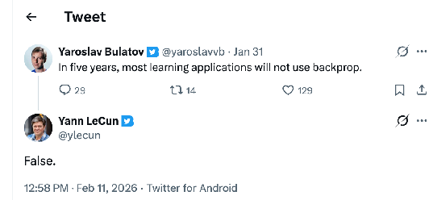

# What comes after Deep Learning?

## Personal History of Deep Learning

### 2004 Conditional Random Fields

Training conditional random fields via gradient tree boosting, Tom Dietterich  
[https://dl.acm.org/doi/abs/10.1145/1015330.1015428](https://dl.acm.org/doi/abs/10.1145/1015330.1015428)  
  
2005 Cycle-corrected Belief Propagation [pdf](http://www.yaroslavvb.com/papers/bulatov-cycle.pdf)

### 2013 Google, OCR

**OCR pipeline at Google** — rigid hand-built system split across multiple stages, each tuned by different experts. Used as the "before" picture of a bounded, partitioned design.

\- Binarization  
\- Segmentation  
\- Classification

People really leaned into their respective objectives:  
suboptimization

Tesseract OCR engine

Combination of brittle pipelines. Worked well for books after 20 years of tweaking. Failed for outside text.

Andrew Ng comes to Google to teach UFDLD class  
  
\- 1st time implementing backprop by hand

StreetView House Numbers

First DL deployment at Google

Initial reaction skeptical  
(we tried deep learning in the 80s, try SIFT)

[https://arxiv.org/abs/1312.6082](https://arxiv.org/abs/1312.6082)

(hired Ian Goodfellow as an intern through this blogpost)  
[https://yaroslavvb.blogspot.com/2013/12/deep-learning-internship-at-google.html](https://yaroslavvb.blogspot.com/2013/12/deep-learning-internship-at-google.html)

**Lesson: removing walls of abstraction opens up new directions**

### 2015 Google Brain Team

DistBelief \-\> Tensorflow

tensorflow::ops::DiagPart

How backprop was implemented originally  
\- Lua Port  
\- Rajat  
\- 2nd-5th time implementing backprop by hand

### 2018  OpenAI, gradient checkpointing

Gradient checkpointing with Tim Salimans  
[cybertronai/gradient-checkpointing](https://github.com/cybertronai/gradient-checkpointing)

  
\- 6nd-7th time implementing backprop by hand

**Lesson: backprop sucks when memory is expensive**

### 2018 DAWN Imagenet competition

Joined forces with a couple of talented juniors and beat Google at "who can train ImageNet to 75% the fastest, with no limit on compute used".   
With a bright mobile engineer from fast.ai, Andrew Shaw

  
\- [https://www.technologyreview.com/2018/08/10/141098/small-team-of-ai-coders-beats-googles-code/](https://www.technologyreview.com/2018/08/10/141098/small-team-of-ai-coders-beats-googles-code/)  
\- [https://github.com/cybertronai/imagenet18](https://github.com/cybertronai/imagenet18)  
\- [https://dawn.cs.stanford.edu/dawnbench](https://dawn.cs.stanford.edu/dawnbench)

Cited as an "unnamed collaborator working for US military"

**Lesson: fast iteration \>\> thinking about beautiful ideas for a while**

### 2019 Transformer-XL

GPT-2 reproduction

### 

Led to first LLM code completion system in JetBrains.

### 2023 PyTorch Distributed team

Symbolic Differentiation engine, NCCL migration

  
[colab](https://colab.research.google.com/drive/1BDFc9poKybcxeu_RpGGL7_HjqlLjuqfq), wolfram community [post](https://community.wolfram.com/groups/-/m/t/2437093)

\- 7th-10th time implementing backprop by hand

### 2025 Scaling Laws from Free Probability

[Together.AI](http://Together.AI)   
Scaling Laws with Chris De Sa, Thomas Ahle, Chris Re. [preprint](https://drive.google.com/file/d/1nHWhd7tVTQh15l5iYlU1AQFgfEB-Ym6_/view)  

Impractical Research [talk](https://www.youtube.com/watch?v=5CUTOOz-pYY&t=14s)  

**Lesson: research as a whole is useful, the value of any individual paper is marginal (still fun though)**

### 2026 Sutro Group

Sutro group: solve AI using AI

[SutroYaro](https://github.com/cybertronai/SutroYaro)  
Hinton Problems [repo](https://github.com/cybertronai/hinton-problems/)  
Schmidthuber Problems [repo](https://github.com/cybertronai/schmidhuber-problems)  
  
  
[SutroAna](https://github.com/cybertronai/SutroAna)  
[matmul](https://github.com/cybertronai/sutro-problems/tree/main/matmul)  
  
  
[sparse parity](https://github.com/cybertronai/sutro-problems/tree/main/sparse-parity)  
  
  
[wikitext](https://github.com/cybertronai/wikitext)

**Lesson: agents can one-shot swathes of research now**

# Examples of Path Dependencies

What is path dependency? 

1\. make a **good** design decision  
2\. the environment changes  
3\. decision is now **bad**

## Puzzle

  
\<slide\>

  
\<slide\>

\<slide\>

## Nuclear Reactors

* **Nuclear Power: The "Submarine" Trap**  
  * **The Lock-in:** Light Water Reactors (LWR) are the standard for nuclear power, but they are not the safest or most efficient design. They became the standard because **Admiral Rickover** needed a compact reactor for *submarines*.  
  * **The Failure:** The civilian industry just copied the submarine supply chain. We spent 50 years optimizing a "submarine engine" for cities, ignoring better designs (like Molten Salt Reactors) because the supply chain already existed.

\<slide\>

## Laryngeal nerves

\<slide\>

Old embryonic morphogenesis program  
New anatomic dimensions  
Embryonic morphogenesis program **now obsolete** (but hard to change)

## Python Global Interpreter Lock

  
1992 GIL  
2005 multi-core machines  
2030 no-GIL by default (if we are lucky)

# Path dependencies in Deep Learning

What is path dependency? 

1\. make a good design decision  
2\. the environment changes  
3\. decision is now bad

\- Design decisions made in the old era  
\- generic components: losses, optimizers, activations  
\- sequential dependencies: layers, gradient descent.  
\- low compute-to-commute ratio: backprop

\- The environment changed  
\- A. shifting hardware  
\- B. narrowing of application

## Environment change

### Hardware drift

#### The Memory wall

  
Arithmetic is now essentially free

  
\<slide\>

#### The end of Dennard scaling

Compilers are trying to make things work, yet abstractions leak. Some algorithms are impossible to parallelize (hence minibatching)

  
\<slide\>

#### Unreliable components

[https://arxiv.org/pdf/2407.21783](https://arxiv.org/pdf/2407.21783)

The Llama 3 Herd of Models  

### Applications drift

Original Deep learning didn't have an application, so the aims were broad.

#### Rosenblatt, (eventual) space exploration

1958, The New York Times  
  
\<slide\>

#### Andrew Ng, helicopter control

Lack of deep learning "product market fit" means we focused on components reusable across domains  
\- blackbox optimizers  
\- generic loss functions  
\- reusable components (ReLU)

## Design decisions

What design decisions were made in the old environment?

### Gradient descent

Black box optimizers (designed for shifting demands)  
Hit a dead-end.  
Descending a crowded [valley](https://arxiv.org/pdf/2007.01547)

# 

\<slide\>

### Backprop

Targetting low compute/commute ratio

  
\<slide\>

### Synchronous training

Good for reliable set of compoments

#### 	Story of async/sync switch at Google

\- Original models trained async. Then switched to sync shortly after GPU training.

Anecdotally it happened as follows:  
\- Shubho Sengupta got it working in Baidu  
\- Andrew Ng told Jeff Dean  
\- Jeff Dean told Google Brain folks to try it.

Ultimately reasons for the switch were as follows:  
\- 1.minor improvement in accuracy on the ImageNet  
\- 2\. sync runs were deterministic, making debugging

# Things which hard to change

Expensive things.

\- Large ambition requires large capital  
\- Large capital is conservative.  
\- Hence “kill zone”:  
technology that is promising but not bankable.

## 2018 Cade Metz article

45 AI hardware startups.

## 300-\>450 wafer upgrade story

# Things which easy to change

**Cheap** things.

This year: Learning algorithm development.

Implement 55 Hinton papers: 1.2B tokens ([visual\_tour](https://github.com/cybertronai/hinton-problems/))  

\<slide\>  
Implement 58 Schmidhuber papers: 1.5B tokens [visual\_tour](https://github.com/cybertronai/schmidhuber-problems/blob/main/VISUAL_TOUR.md)

# The future

Redeveloping of algorithms (**easy to change**)  
*for a better fit*  
to existing hardware (**hard to change**)

## Potential Examples

Which things become possible with AI agents?

### Fewer abstraction splits

Why do we have abstractions?  
n² communication bottleneck.  
If a task requires more than x people, better to split.  
Capable people \= Less people needed \= less splits.  
Less splits \= more freedom to improve things\!

#### Mega-kernels

framework/kernel wall split  

### Hardware-specific algorithms

math/compiler wall split

Old world \= slow feedback.

Mini-batching motivated by the memory wall.  
(most researchers don't know that)

2003 \- "The general inefficiency of batch training for gradient descent learning"

  
\<slide\>

2006 \-- "A Fast Learning Algorithm for Deep Belief Nets" [https://www.cs.toronto.edu/\~fritz/absps/ncfast.pdf](https://www.cs.toronto.edu/~fritz/absps/ncfast.pdf)  
  
\<slide\>  
Explosion of DSLs this year

### Novel learning algorithms

Backprop compute-to-commute ratio suits for pre-memory-wall era.  
What is natural for the post-memory-wall era?

### Architecture/optimizer co-design

Scientific computing literature customizes equation solvers to the structure of the problem.  
\- multigrid methods  
\- fast multipole  
\- etc.

Deep Learning uses the same optimizer for convolutional networks as for Transformers.  
\- going from blackbox to architecture specialized  
ex: Adam is blackbox, Muon is not blackbox

## Approach

\- Repeat old approach  
\- But faster

(we spent 70 years trying semi-random things on toy prolems)

### Path to attention

\- Deep Sets (Zaheer et al. 2017\)  
\- Deep Sets with Attention aka Multi-Instance Learning (Ilse, Tomczak, Welling, ’18)  
\- Bag of words (Salton & McGill, 1986\) Word2Vec (Mikolov et al., 2013\)  
\- Attention weighting for documents (Wang et al, ’16)  
\- Hierarchical attention weighting (Yang et al. ’17)  
\- Question Answering with Pooling and Iteration (Sukhbaatar et al., ’15)  
\- Seq2Seq with attention (Bahdanau, Cho, Bengio ’14) (Pham, Luong, Manning ’15)  
\- Pointer networks for finding convex hull (Vinyals et al., ‘15)  
\- Transformer with multi-head attention (Vaswani et al., ‘17)

(from Alex Smola attention [talk](https://alex.smola.org/talks/ICML19-attention.pdf))

### Sutro Group

[Sutro Group: top level](https://docs.google.com/document/d/1B9867EN6Bg4ZVQK9vI_ZqykZ5HEtMAHJ7zBGGas4szQ/edit?tab=t.0#heading=h.j6rssh3enbtd)  
[https://t.me/sutro\_group](https://t.me/sutro_group)  
open-source+1 (Unlicense)

agentic research:  
[SutroYaro](https://github.com/cybertronai/SutroYaro)  
[SutroAna](https://github.com/cybertronai/SutroAna)

hill-climbing:  
theory track (can we make learning memory friendly?):  
[matmul](https://github.com/cybertronai/sutro-problems/tree/main/matmul)  
[sparse-parity](https://github.com/cybertronai/sutro-problems/tree/main/sparse-parity)  
applied track (measure actual Joules)  
[wikitext](https://github.com/cybertronai/wikitext)

# BarCode

## 
