# What comes after Deep Learning?

---

## Personal History of Deep Learning

### 2004

#### Conditional Random Fields

Training conditional random fields via gradient tree boosting, Tom Dietterich  
[https://dl.acm.org/doi/abs/10.1145/1015330.1015428](https://dl.acm.org/doi/abs/10.1145/1015330.1015428)  
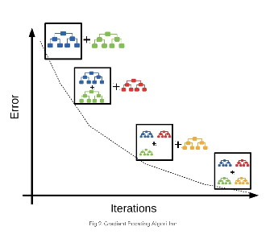

### 2013

**OCR pipeline at Google** — rigid hand-built system split across multiple stages, each tuned by different experts. Used as the "before" picture of a bounded, partitioned design.

\- Binarization  
\- Segmentation  
\- Classification

People really into their respective objectives \=\> suboptimization

[https://dl.acm.org/doi/10.1109/ICDAR.2013.219](https://dl.acm.org/doi/10.1109/ICDAR.2013.219)  
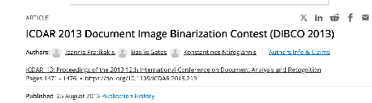

Tesseract OCR engine

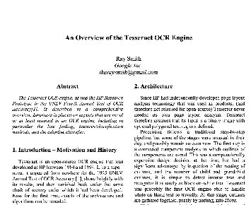

Combination of braille pipelines. Worked well for books. Failed for outside text.

Andrew Ng comes to Google to teach UFDLD class  
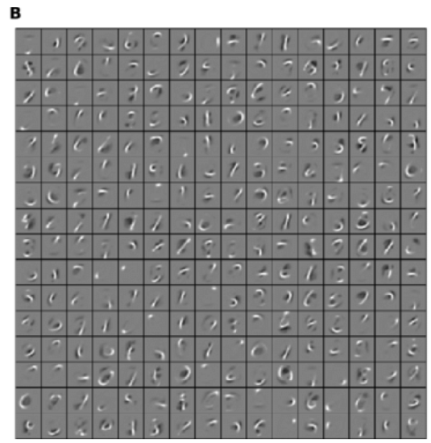

#### 2013 StreetView House Numbers

First DL deployment at Google

Initial reaction skeptical  
	(we tried deep learning in the 80s, try SIFT)

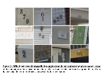

[https://arxiv.org/abs/1312.6082](https://arxiv.org/abs/1312.6082)

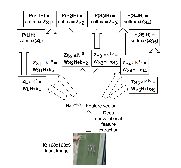

(hired Ian Goodfellow as an intern through this blogpost)  
[https://yaroslavvb.blogspot.com/2013/12/deep-learning-internship-at-google.html](https://yaroslavvb.blogspot.com/2013/12/deep-learning-internship-at-google.html)

**Lesson: removing walls of abstraction opens up new directions**

---

## 2018 

### OpenAI, gradient checkpointing

Gradient checkpointing with Tim Salimans  
[https://github.com/cybertronai/gradient-checkpointing](https://github.com/cybertronai/gradient-checkpointing)  
[https://medium.com/tensorflow/fitting-larger-networks-into-memory-583e3c758ff9](https://medium.com/tensorflow/fitting-larger-networks-into-memory-583e3c758ff9)

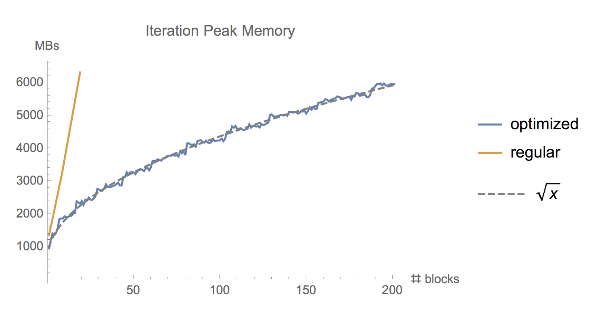

**Lesson: backprop sucks when memory is expensive**

---

## 2018

### DAWN Imagenet competition

Joined forces with a couple of talented juniors and beat Google at "who can train ImageNet to 75% the fastest, with no limit on compute used".   
With a bright mobile engineer from fast.ai, Andrew Shaw

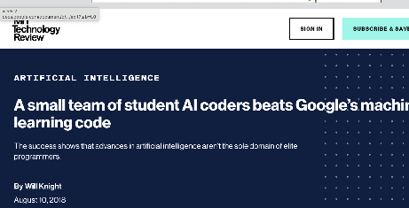

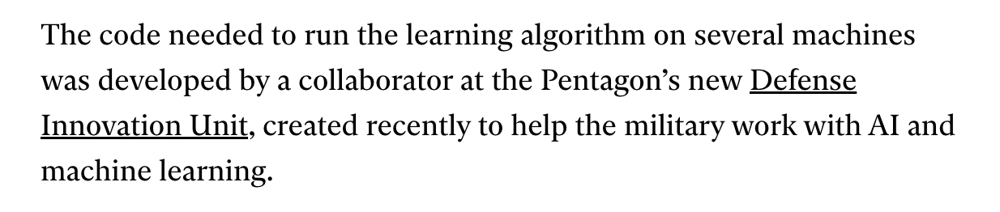  
\- [https://www.technologyreview.com/2018/08/10/141098/small-team-of-ai-coders-beats-googles-code/](https://www.technologyreview.com/2018/08/10/141098/small-team-of-ai-coders-beats-googles-code/)  
\- [https://github.com/cybertronai/imagenet18](https://github.com/cybertronai/imagenet18)  
\- [https://dawn.cs.stanford.edu/dawnbench](https://dawn.cs.stanford.edu/dawnbench)

Cited as an "unnamed collaborator working for US military"

**Lesson: fast iteration \>\> thinking about beautiful ideas for a while**

---

## 2019

### Transformer-XL

GPT-2 reproduction

### 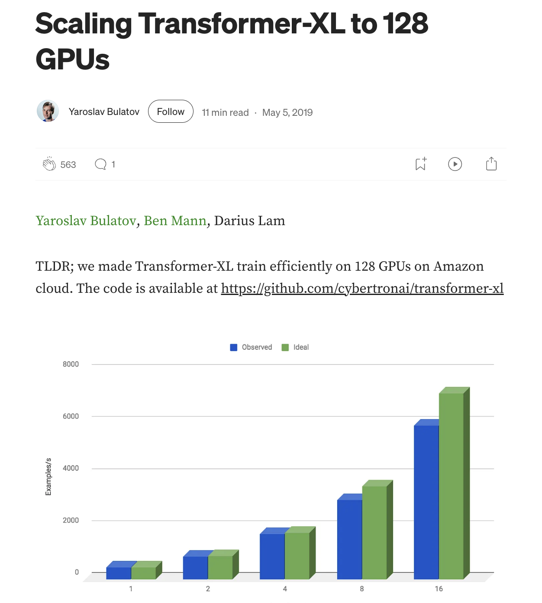

[https://yaroslavvb.medium.com/scaling-transformer-xl-to-128-gpus-d21875961c5d](https://yaroslavvb.medium.com/scaling-transformer-xl-to-128-gpus-d21875961c5d)

Led to first LLM code completion system in JetBrains

**Lesson: being too early is as bad as being too late. (also [near.ml](http://near.ml), tab9)**

---

## 2023

### Symbolic Differentiation in PyTorch

PoC for Symbolic Differentiation engine at PyTorch team [https://colab.research.google.com/drive/1BDFc9poKybcxeu\_RpGGL7\_HjqlLjuqfq](https://colab.research.google.com/drive/1BDFc9poKybcxeu_RpGGL7_HjqlLjuqfq)  
[https://community.wolfram.com/groups/-/m/t/2437093](https://community.wolfram.com/groups/-/m/t/2437093)

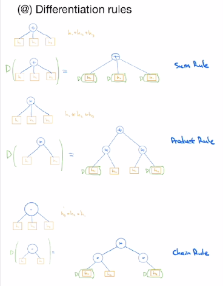

**Lesson: not enough to give a give users a nice library, need to also do the migration**

---

## 2025

[Together.AI](http://Together.AI) 

### Scaling Laws from Free Probability

Scaling Laws with Chris De Sa, Thomas Ahle, Chris Re. [preprint](https://drive.google.com/file/d/1nHWhd7tVTQh15l5iYlU1AQFgfEB-Ym6_/view)  
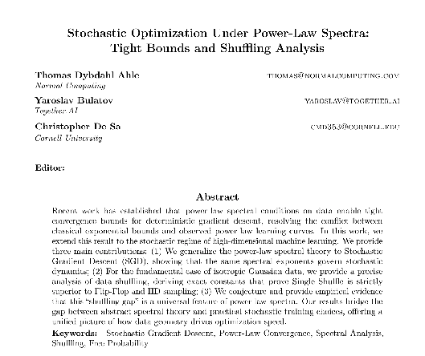

Impractical Research [talk](https://www.youtube.com/watch?v=5CUTOOz-pYY&t=14s)  

**Lesson: research as a whole is useful, the value of any individual paper is marginal (still fun though)**

---

## 2026

Sutro group: solve AI using AI

[SutroYaro](https://github.com/cybertronai/SutroYaro)  
	\- Hinton Problems [repo](https://github.com/cybertronai/hinton-problems/)  
	\- Schmidthuber Problems [repo](https://github.com/cybertronai/schmidhuber-problems)  
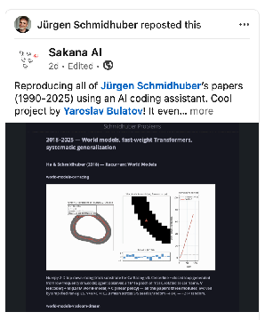  
	  
[SutroAna](https://github.com/cybertronai/SutroAna)  
	\- [matmul](https://github.com/cybertronai/sutro-problems/tree/main/matmul)  
	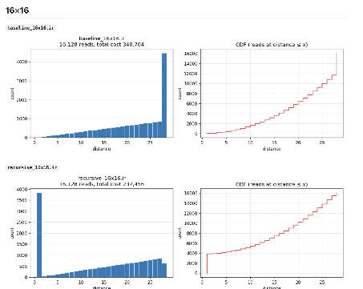  
	  
	\- [sparse parity](https://github.com/cybertronai/sutro-problems/tree/main/sparse-parity)  
	  
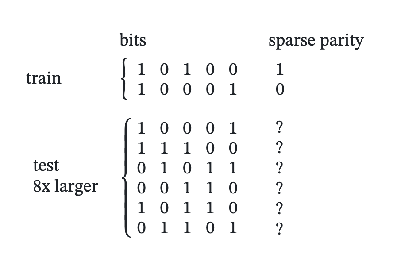  
\- [wikitext](https://github.com/cybertronai/wikitext)

**Lesson: agents can one-shot swathes of research now**

---

# Examples of Path Dependencies

What is path dependency? 

1\. make a **good** design decision  
2\. the environment changes  
3\. decision is now **bad**

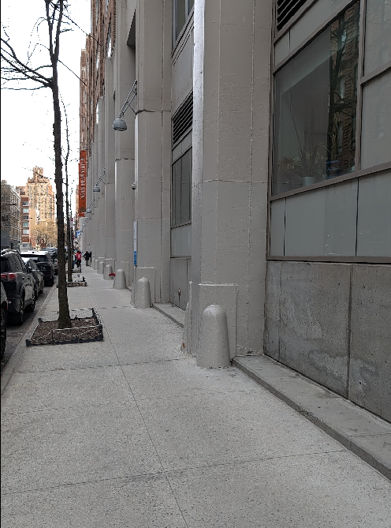

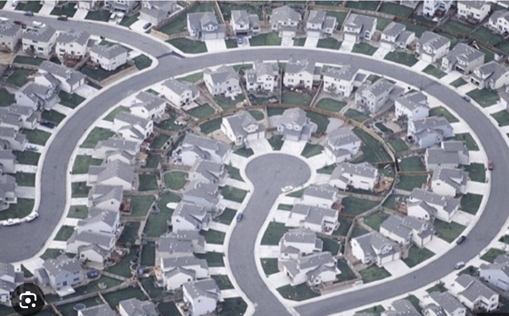

---

## Nuclear Reactors

* **Nuclear Power: The "Submarine" Trap**  
  * **The Lock-in:** Light Water Reactors (LWR) are the standard for nuclear power, but they are not the safest or most efficient design. They became the standard because **Admiral Rickover** needed a compact reactor for *submarines*.  
  * **The Failure:** The civilian industry just copied the submarine supply chain. We spent 50 years optimizing a "submarine engine" for cities, ignoring better designs (like Molten Salt Reactors) because the supply chain (the "interface") already existed.

---

## Laryngeal nerves

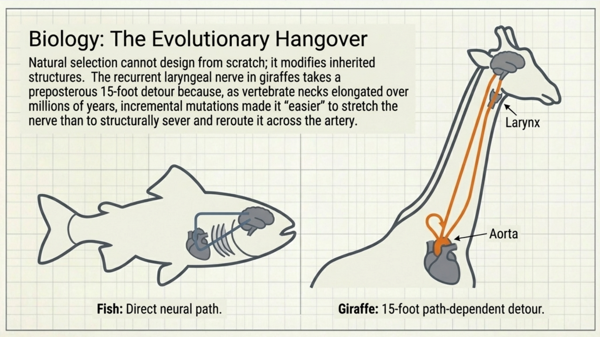

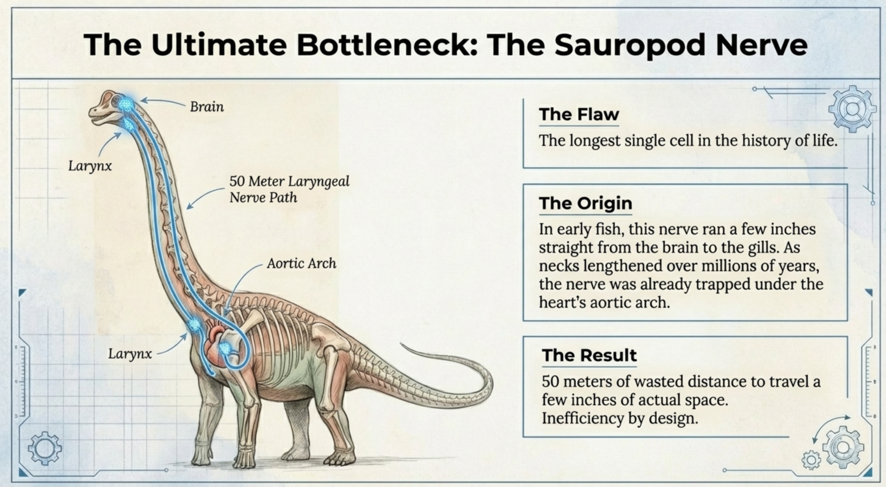

Old embryonic morphogenesis program  
New anatomic dimensions  
Embryonic morphogenesis program **now obsolete** (but to change)

---

# Path dependencies in Deep Learning

What is path dependency? 

1\. make a good design decision  
2\. the environment changes  
3\. decision is now bad

\- Design decisions made in the old era  
	\- generic components: losses, optimizers, activations  
	\- sequential dependencies: layers, gradient descent.  
	\- low compute-to-commute ratio: backprop

\- The environment changed  
\- A. shifting hardware  
\- B. narrowing of application

---

## Environment change

### Hardware drift

#### The Memory wall

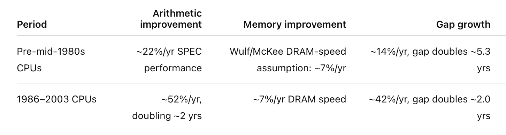  
Arithmetic is now essentially free

#### The end of Dennard scaling

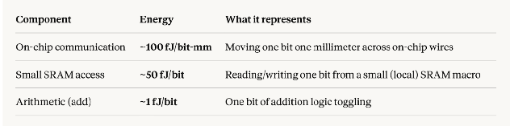

Compilers are trying to make things work, yet abstractions leak. Some algorithms are impossible to parallelize (hence minibatching)

3\. Too many components to be reliable  
[https://arxiv.org/pdf/2407.21783](https://arxiv.org/pdf/2407.21783)

The Llama 3 Herd of Models  

### Applications drift

Original Deep learning didn't have an application, so the aims were broad.

#### Rosenblatt, (eventual) space exploration

1958, The New York Times  
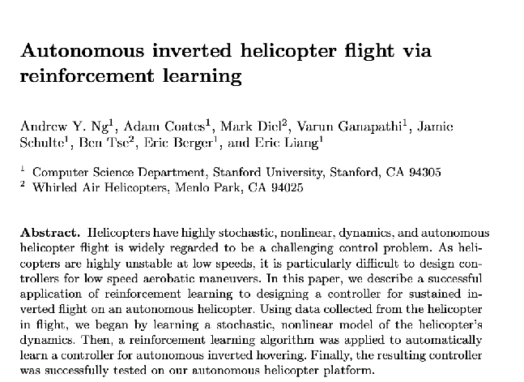

#### Andrew Ng, helicopter control

https://cs.stanford.edu/groups/helicopter/papers/iser04-invertedflight.pdf  
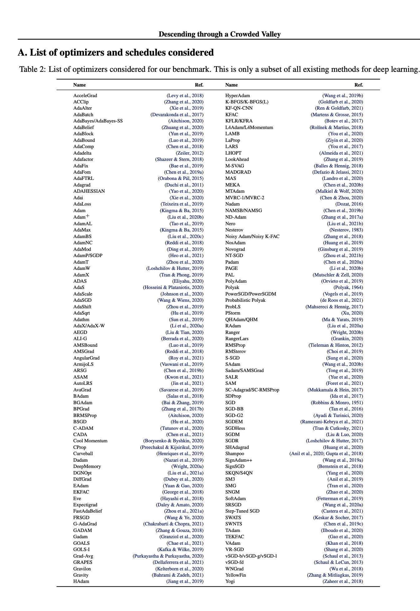

Lack of deep learning "product market fit" means we focused on components reusable across domains  
	\- blackbox optimizer  
	\- generic loss functions

---

## Design decision

### Gradient descent

	Black box optimizers (designed for shifting demands)  
	Hit a dead-end.

---

# 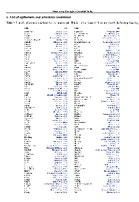

### Backprop

	Targetting low compute/commute ratio  
	[https://github.com/cybertronai/gradient-checkpointing](https://github.com/cybertronai/gradient-checkpointing)

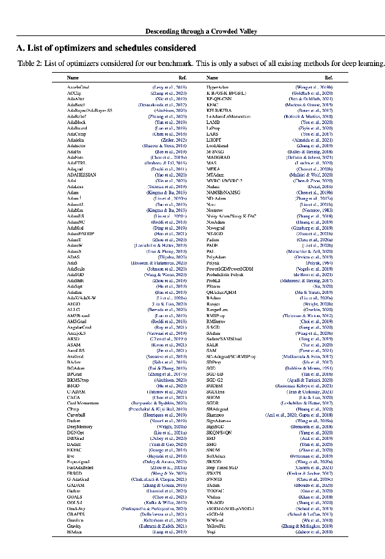

### Synchronous training

	Good for reliable set of compoments

	When I trained the first production models for Google StreetView ([paper](https://arxiv.org/abs/1312.6082)), the results were good enough to switch the entire division from classical computer-vision methods to neural networks. These models were trained asynchronously.

Later, working at Google Brain, I observed the switch from async to synchronous training. Anecdotally it happened as follows:  
\- Shubho Sengupta got it working in Baidu  
\- Andrew Ng told Jeff Dean  
\- Jeff Dean told Google Brain folks to try it.

Ultimately reasons for the switch were as follows:  
1\. there was a minor improvement in accuracy on the ImageNet dataset which made publishing easier. A couple of percent improvement over state-of-the-art matter for tasks with small fixed dataset.  
2\. sync runs were deterministic, making debugging and research easier.

At the time, a typical run would use less than a hundred GPUs on a cluster with an uncongested network. Weaknesses of the synchronous approach did not come to light.

---

# Things which hard to change

Expensive things.

Large ambition requires large capital, but large capital is usually conservative. That creates a “kill zone” where a technology can be promising but not bankable.

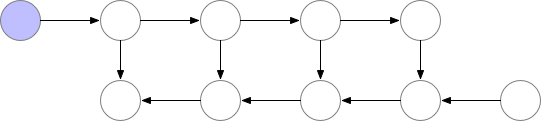

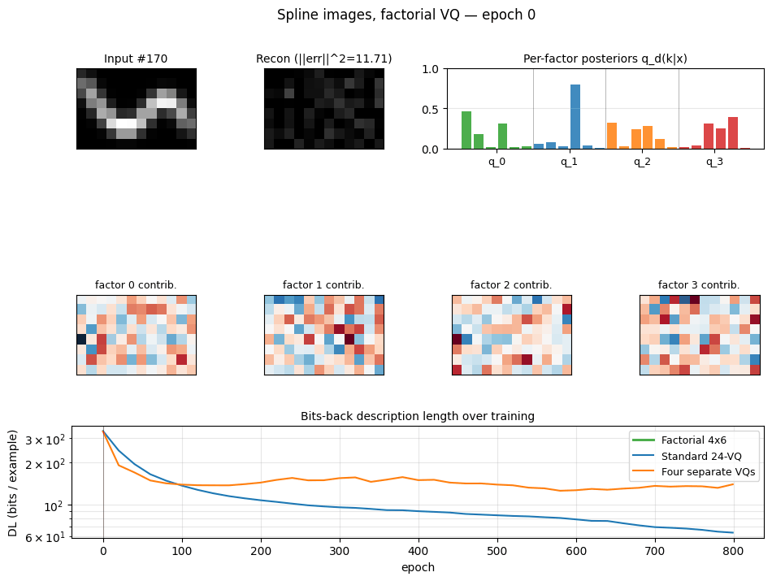

300mm-\>450mm wafer effort cost was $1-5B, abandoned

---

# Things which easy to change

Cheap things.

This year: Learning algorithm development.

Implement 55 Hinton papers: 1.2B tokens ([visual\_tour](https://github.com/cybertronai/hinton-problems/))  
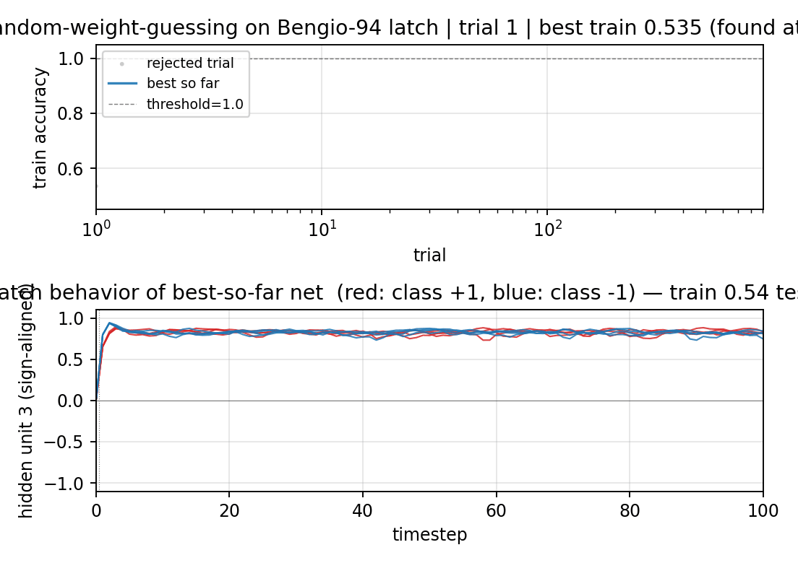

Implement 58 Schmidhuber papers: 1.5B tokens [visual\_tour](https://github.com/cybertronai/schmidhuber-problems/blob/main/VISUAL_TOUR.md)

Kernel Sage, TenX Semi, Verkor, ChipStack, Architect Labs, Ricursive Intelligence, Tattvam

---

# The future

Redeveloping of algorithms (**easy to change**)  
*for a better fit*  
to existing hardware (**hard to change**)

---

## Examples

### Fewer abstraction splits

Why do we have abstractions?  
n^2 communication bottleneck.  
If a task requires more than x people, better to split.  
Less people \= less splits.  
Less splits \= more freedom\!

#### Mega-kernels

framework/kernel wall split  

### Hardware-specific algorithms

math/compiler wall split

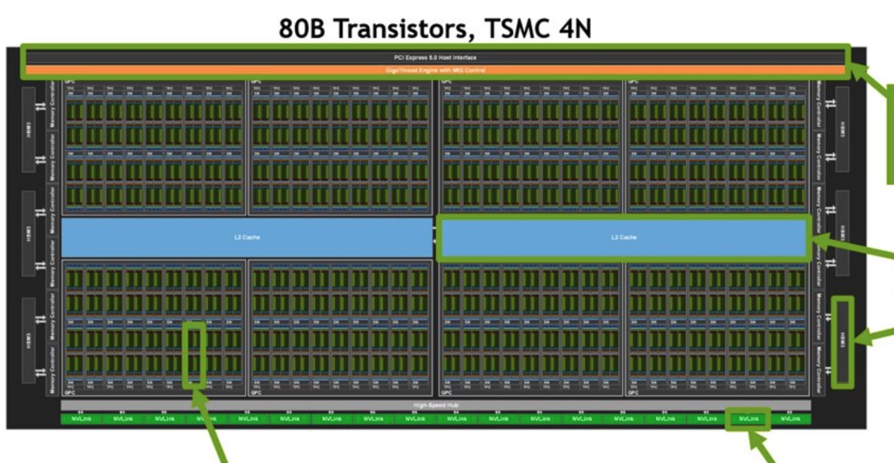

Old world \= slow feedback.

Mini-batching is motivated by the memory wall.  
But most researchers don't know that.

"The general inefficiency of batch training for gradient descent learning"  
2003 paper \-- minibatching is always worse  
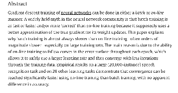  
2006 \-- "A Fast Learning Algorithm for Deep Belief Nets" [https://www.cs.toronto.edu/\~fritz/absps/ncfast.pdf](https://www.cs.toronto.edu/~fritz/absps/ncfast.pdf)  
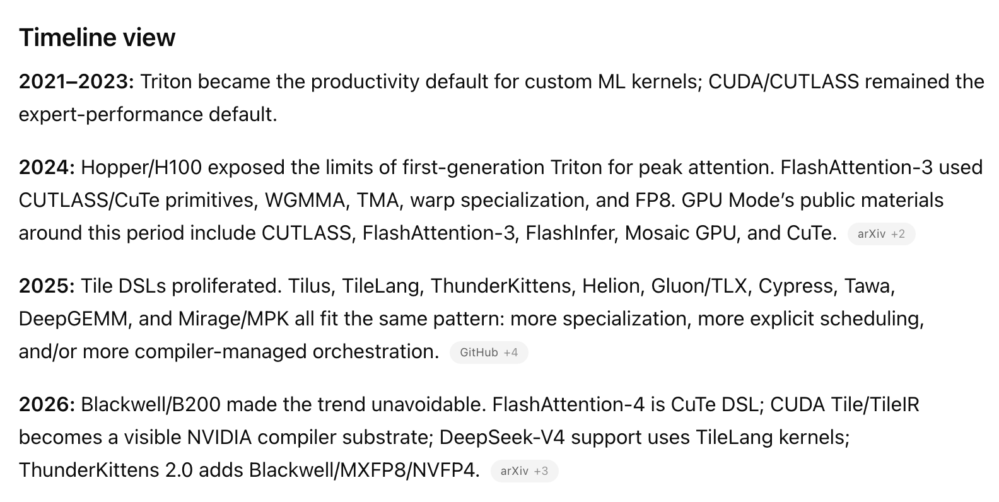

### Novel learning algorithms

Backprop compute-to-commute ratio is designed for pre-memory-wall era.

### Architecture/optimizer co-design

Scientific computing literature customizes equation solvers to the structure of the problem.  
	\- multigrid methods  
	\- fast multipole  
	\- etc.

Deep Learning uses the same optimizer for convolutional networks as for transformers.
